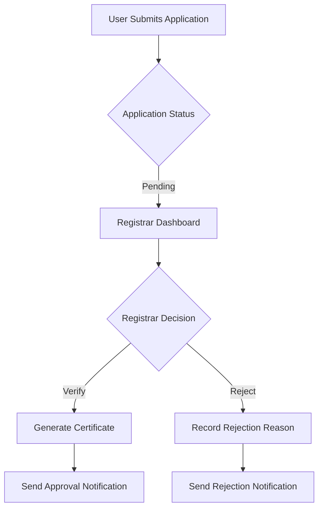

# Certificate Verification System

## Overview

The Certificate Verification System is a critical component of the Digital Birth Certificate Platform, designed to provide a secure, transparent, and efficient process for verifying birth certificate applications.

## Key Features

### 1. Verification Workflow
- **Pending Applications**: All new applications start in a 'pending' status
- **Registrar Review**: Registrars can verify or reject applications
- **Automated Tracking**: Comprehensive logging of all verification activities

### 2. Verification Dashboard
- Real-time view of pending applications
- Detailed application information
- One-click verification and rejection
- Audit trail for each action

## Technical Architecture

### Components
- `CertificateController`: Handles HTTP requests for verification
- `CertificateVerificationService`: Core business logic for verification
- `NotificationService`: Sends notifications about application status
- Verification Repositories: Data access for applications and certificates

### Verification Process

1. **Application Submission**
   - User submits birth certificate application
   - Application status: `pending`

2. **Registrar Review**
   - Registrar accesses verification dashboard
   - Views pending applications
   - Can perform two actions:
     a. **Verify**: Approves application
     b. **Reject**: Declines application with reason

3. **Verification Actions**

#### Verification Flow


### Security Measures
- Role-based access control
- Transaction-based verification
- Comprehensive logging
- Immutable verification records

## Database Schema

### Tables
- `certificates`: Stores issued certificates
- `verification_logs`: Tracks all verification activities
- `birth_applications`: Updated with verification metadata

### Certificate Number Generation
- Prefix: `BC` (Birth Certificate)
- Year: Current year
- Unique Identifier: Padded application ID

Example: `BC2024000123`

## API Endpoints

### Verification Endpoints
- `GET /verify`: Verification dashboard
- `POST /certificates/verify/{id}`: Verify application
- `POST /certificates/reject/{id}`: Reject application
- `GET /verify/certificate/{number}`: Validate certificate

## Configuration

### Environment Variables
```ini
# Verification System Settings
VERIFICATION_ENABLED=true
MAX_VERIFICATION_TIME=30 # days
REQUIRE_MULTIPLE_VERIFIERS=false
```

## Troubleshooting

### Common Issues
1. **Verification Failures**
   - Check user roles
   - Verify database connections
   - Review application status

2. **Performance Considerations**
   - Implement caching for verification dashboard
   - Use database indexing
   - Monitor query performance

## Future Enhancements
- Multi-stage verification
- Machine learning fraud detection
- Integration with external verification services

## Compliance
- GDPR compliant data handling
- Secure personal information management
- Comprehensive audit trails

## Monitoring & Logging
- Track all verification activities
- Generate verification reports
- Alert on suspicious activities

## Best Practices
- Always verify user roles
- Implement rate limiting
- Use prepared statements
- Validate and sanitize all inputs
- Maintain comprehensive logs 